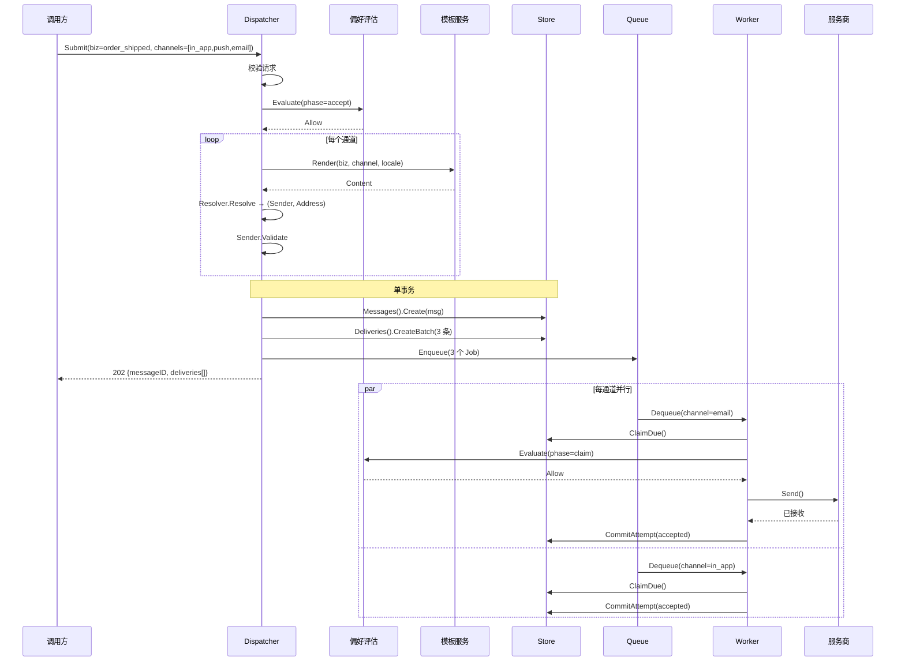
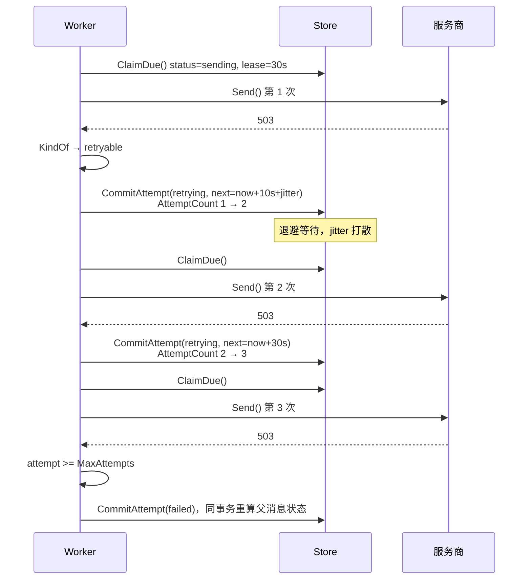
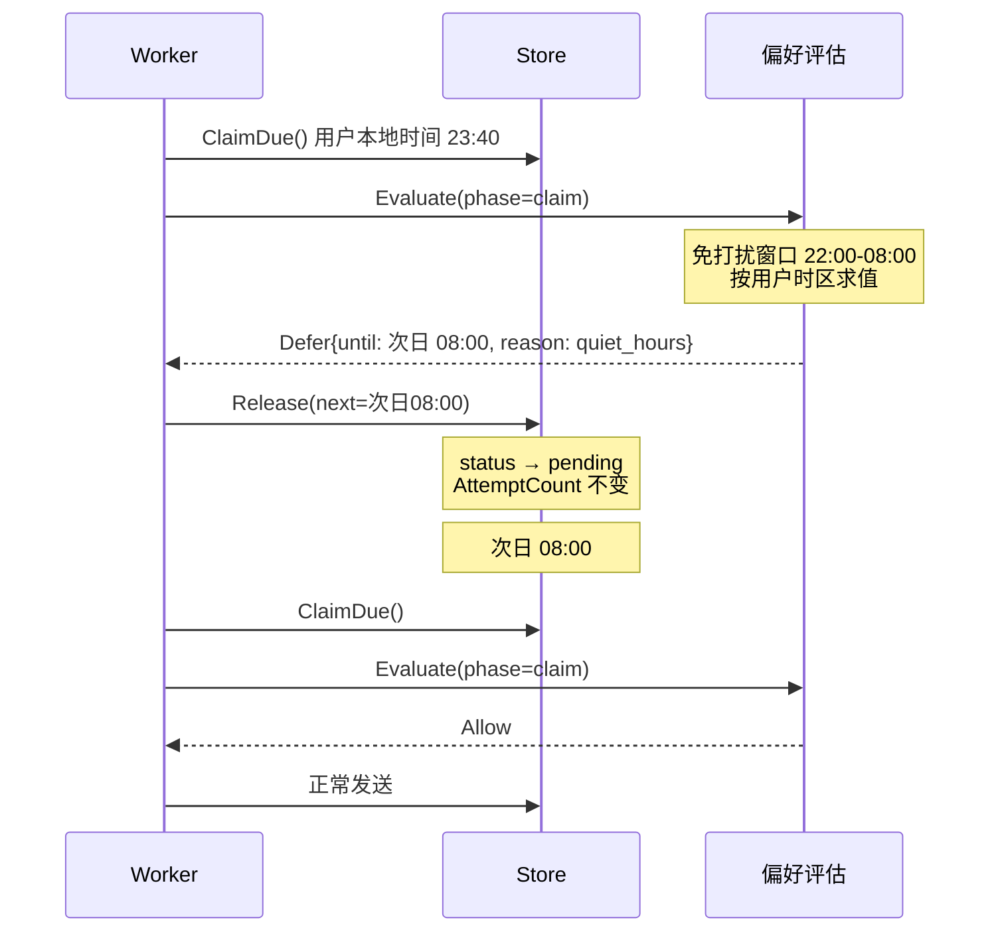

# 架构

## 目标

统一收敛五类出站通知（站内信、移动 Push、邮件、短信、Webhook）的发送路径，使"给用户发一条消息"成为一次调用，而不是五套 SDK、五套重试逻辑、五套投递记录。

难点不在调用服务商接口，而在重试语义、部分成功、幂等、投递记录和用户偏好这些横切关注点。这些定错，每增加一个通道都要还债；定对之后，增加一个通道就是写一个文件。

## 分层

```
mcerr  ←──  message  ←──  {template, queue, preference, channel, store}
                                    ↑
                              dispatch
                                    ↑
                    internal/transport/gin, internal/store/mysql, cmd/
```

依赖无环，`mcerr` 为叶子包。领域包需要返回带类型的错误，因此错误包不能反向依赖它们。

| 包 | 职责 | 依赖 |
|---|---|---|
| `mcerr` | 错误分类 | 无内部依赖 |
| `message` | 领域模型与状态机 | `mcerr` |
| `channel` | Sender 扩展点、限流 | `message` |
| `template` | 模板解析与渲染 | `message` |
| `queue` | 工作队列契约 | `message` |
| `preference` | 用户偏好、免打扰、频控 | `message` |
| `store` | 持久化契约 | `message`、`template` |
| `dispatch` | 编排 | 全部 |

`pkg/` 与 `internal/` 的分界：外部使用者需要 import 的放 `pkg/`，绑定具体厂商或框架的放 `internal/`。自定义 Sender 要求 `channel`，接入自有数据库要求 `store`，进程内调用要求 `dispatch`；Gin handler、MySQL 实现和真实通道 Sender 都属于后者。

## 领域模型

```
Message       一次调用方意图
  Delivery    一个通道的那一份，重试的最小单位
    Attempt   一次服务商调用，只追加的历史
```

不采用"一行消息加一个通道数组"，因为那样重试粒度会塌缩：一行包含三个通道时，重试要么重跑全部三个并重复发送已成功的部分，要么把每通道的重试计数存入无法建索引的 JSON。多一层表的代价换来独立重试、准确的部分成功上报和按通道的运维可见性。

`Message` 是信封，记录调用方请求与最终结果。任何会失败、会重试或因传输方式而异的状态都在 `Delivery` 上。

## 状态模型

状态分成两套，对应两类不同性质的事实。

### 发送状态：`DeliveryStatus`

描述消息中心能控制的部分，止于 `DeliveryAccepted`，即服务商已接收消息。

```
pending ──claim──▶ sending ──服务商接收──▶ accepted
   │                  │
   │                  ├─ permanent / 重试耗尽 ──▶ failed
   │                  ├─ retryable，有余额    ──▶ retrying ──┐
   │                  │                                      │
   │                  ├─ 关闭 / aborted（释放租约）──▶ pending │
   │                  │                                      │
   │                  └─ TTL 到期 ──▶ expired                 │
   │                                        ◀── backoff 到期 ─┘
   ├─ 无地址 / 已退订 / 被丢弃 ──▶ skipped
   ├─ 取消 ──▶ canceled
   └─ TTL  ──▶ expired
```

终态：`accepted`、`failed`、`skipped`、`canceled`、`expired`。

两个迁移承担主要语义：

- `sending → pending` 是唯一的向后迁移，用于释放租约，不消耗 `AttemptCount`。一次被释放的尝试等于没有发生。若为它记账，一次滚动发布就会耗光所有在途投递的重试预算，且不会产生任何服务商调用。
- `pending → skipped` 用于退订、无可用地址、被免打扰或频控丢弃。不计为失败。这些是系统正常工作的结果，计入错误率会使该指标失去意义。

状态名使用 `accepted` 而非 `succeeded`。服务商同步确认接收，异步确认真实送达。命名为 `succeeded` 会使看板、告警和对外沟通在"该数字的含义"上产生系统性偏差。

### 送达状态：`Milestone` 与 `Receipt`

```
Receipt（只追加，可乱序、可重复）
   ├─ accepted / delivered / read / clicked            ──▶ 推进 Milestone
   └─ bounced / complained / unsubscribed / rejected   ──▶ 正交标记

Milestone：none < delivered < read < clicked
```

不并入同一个枚举，因为回执乱序到达且可能重复：收件人可能先点击链接、打开像素后上报；服务商 webhook 重试会重复投递同一回执；退信可能在送达回执未到达时先到。线性状态机无法表达，强行并入会导致迁移表必须允许 `read → delivered` 和 `delivered → delivered`，此时该表不再描述任何约束。

回执因此按行存储为事实，投递行只保留派生摘要：单调的 `Milestone`（取最大值），以及退信、投诉这类正交标记。

`Delivery.ApplyReceipt` 是唯一正确的应用方式，单调且幂等。重复回执返回 `false`，调用方据此跳过写库。

### 消息状态

```
scheduled ──到点扇出──▶ pending ──┬─ 全部 accepted ──▶ succeeded
    │                             ├─ 部分 accepted ──▶ partially_succeeded
    │                             ├─ 无 accepted ────▶ failed
    └─ 取消 ──▶ canceled          └─ 全部 skipped ───▶ canceled
```

`partially_succeeded` 是终态，且仅在全部投递结束后才声明。邮件仍在重试的消息是 `pending`。

消息状态由投递状态折叠得出（`DeriveStatus`），不独立维护。同时写两处必然导致不一致。

## 扇出

扇出发生在 Dispatcher 的接收阶段，每个通道产生一个 Job。

```
SubmitRequest{channels: [in_app, push, email]}
   └─ Dispatcher.Submit
        ├─ 1. 校验请求
        ├─ 2. 检查未注册 Sender 的通道
        ├─ 3. 硬偏好判定：退订、地址抑制
        ├─ 4. 按通道解析模板并渲染（快照）
        ├─ 5. 按通道解析 Sender 与地址
        ├─ 6. 按通道调用 Sender.Validate
        ├─ 7. 单事务写入 Message 与 Deliveries
        ├─ 8. 每通道入队一个 Job
        └─ 9. 返回 messageID
```

不放在 API 层，否则每个新增传输方式（gRPC、CLI、进程内调用）都要重新实现路由、模板查找和地址解析。

不放在 worker 内部，否则慢速的 SMTP 会阻塞站内信；且重试粒度会退化为"重跑全部通道"，重复发送成为重试的代价。

顺序上的三处约束：

- 第 3 步先于第 4 步。已退订的用户不应进入模板渲染，渲染可能因缺少必填变量或模板被删而失败，而这类失败不应影响一个本就不会发送的消息。
- 第 7 步为单事务。没有投递行的消息行对重试机制不可见，没有消息行的投递行对所有查询不可见。
- 第 8 步后于第 7 步。先入队会使 worker 领到尚未持久化的投递，而这种情况没有正确的恢复方式。

## 时序

### 正常路径



### 退避重试



退避必须带 jitter。缺少 jitter 时，同一时刻失败的投递会在同一时刻重试：服务商抖动产生一批同步失败，确定性退避将其转为一批同步重试，恰好在服务商尝试恢复时到达。

### 免打扰延后



若 defer 时间晚于 `ExpiresAt`，改为 `Drop`，`reason` 为 `expired_during_deferral`。

免打扰和频控判定为延后时，投递带未来的 `NextAttemptAt` 回到 `pending`，`AttemptCount` 不变，走 `Release` 而非 `CommitAttempt`。若误走 `CommitAttempt`，一个设置 22:00-08:00 免打扰的用户在该时段的每条消息都会失败三次并在早晨被标记为永久失败，而期间没有任何服务商调用。该故障的现象是"消息持续失败但服务商日志为空"，无法从错误线索定位到偏好评估。

## 偏好的两阶段求值

| 阶段 | 判定内容 | 时机理由 |
|---|---|---|
| 接收时 | 通道退订、按 biz_type 退订、地址抑制 | 这些是用户的不变事实。违反它们的消息不应产生投递行，否则会留下永远无法成功的记录并计入错误率 |
| claim 时 | 免打扰、频控 | 取决于消息实际发送时刻，该时刻对定时、已延后、重试过的消息都不同于提交时刻 |

仅在接收时求值会使所有定时消息在错误时间发出，并让已延后过的消息在下一次尝试时绕过检查。

详见 [preferences.md](preferences.md)。

## 恢复机制

队列是加速器，投递表是真相。该原则允许第一版使用无持久化的内存队列，代价是必须同时具备三个机制：

| 机制 | 调用 | 缺失后果 |
|---|---|---|
| Sweeper | 周期性 `ClaimDue` 并重新入队 | 队列丢弃的投递永久搁浅 |
| Reclaimer | 启动时及周期性 `ReclaimExpiredLeases` | 每次进程崩溃搁浅其正在处理的投递 |
| Scheduler | 周期性 `ListDueScheduled` | 停机期间到点的定时消息丢失 |

三者都不消耗重试次数。它们恢复的是尚未真正尝试的工作。

`dispatch.Maintenance` 将三者收在同一接口，使"是否接入恢复机制"可由一个构造函数回答。

## 投递语义

系统提供至少一次投递，不提供恰好一次。worker 可能在服务商已接收但 `CommitAttempt` 未写入时崩溃；租约过期后投递被回收重试，用户收到两份。

唯一缓解手段是 `SendRequest.DedupKey()`，由支持幂等键的服务商去重。不支持的服务商需要 Sender 自行对照服务商侧记录。

文档中不得宣称恰好一次。

## 相关文档

- [storage.md](storage.md)：Store 契约与表结构
- [preferences.md](preferences.md)：偏好、频控、回执与里程碑
- [api.md](api.md)：HTTP 路由与报文格式
- [adding-a-channel.md](adding-a-channel.md)：Sender 接入指南
- [traps.md](traps.md)：已知问题与待决策事项
